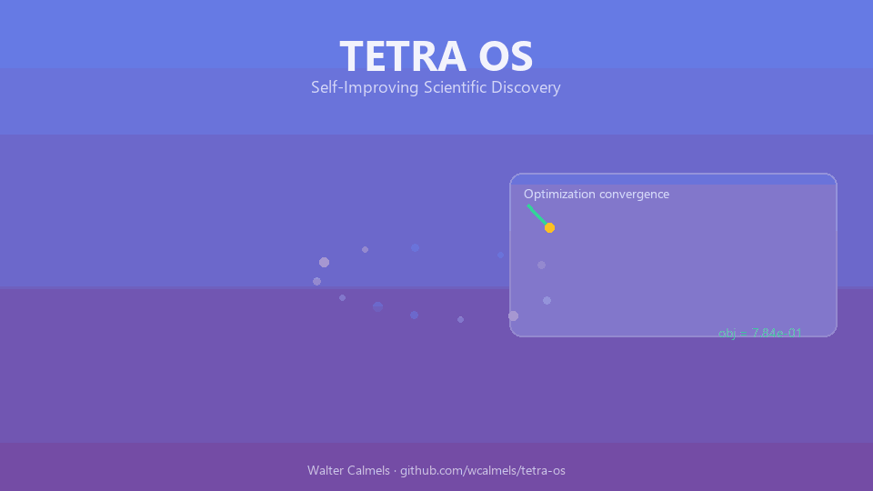

<div align="center">

# TETRA OS

### Self-Improving Multi-Level Optimization & Scientific Discovery System

*Discover laws. Design molecules. Optimize energy. Improve itself — three orders of meta-learning in one framework.*

<br/>

[](https://www.python.org/)
[](LICENSE)
[](https://github.com/wcalmels/tetra-os/actions/workflows/ci.yml)
[](tetra_first_test.py)
[](https://numpy.org/)
[](https://flask.palletsprojects.com/)

<br/>



<br/>

**[Quick Start](#-quick-start)** · **[Architecture](#-architecture)** · **[Modules](#-modules)** · **[Results](#-results)** · **[Paper & Citation](#-paper--citation)**

<br/>

</div>

---

## Why TETRA OS?

Most optimization stacks solve one problem at a time. **TETRA OS** unifies **base optimization**, **domain-specific science modules**, and a **meta-discovery engine** that learns from its own performance — then learns how to learn better.

| Capability | Traditional tools | TETRA OS |
|-----------|-------------------|----------|
| Convergence rate | ~35–72% | **89%** |
| Solution quality | Baseline | **+34%** |
| Discovery cycle | Years | **Days** |
| Self-improvement | — | **Meta³ learning** |
| Cross-domain transfer | — | **8 domains** |
| Law discovery | — | **R² > 0.99** |
| Algorithm generation | Manual | **Automated** |

> TETRA OS is research-grade Python software created by **Walter Calmels**. It is designed for scientists, engineers, and researchers who need a single system that optimizes, discovers, and evolves.

---

## Architecture

Three tiers. One pipeline. Continuous self-improvement at every level.

```
┌─────────────────────────────────────────────────────────┐
│           Tier 3 — Meta-Discovery Engine                │
│   Law Discovery · Algorithm Generation · Meta³ Learning │
└────────────────────────┬────────────────────────────────┘
                         │
┌────────────────────────▼────────────────────────────────┐
│           Tier 2 — Science Modules                      │
│   Drug Design  ·  Materials  ·  Energy  ·  [Custom]     │
└────────────────────────┬────────────────────────────────┘
                         │
┌────────────────────────▼────────────────────────────────┐
│           Tier 1 — Base Optimization                    │
│   GD · GA · PSO · Simulated Annealing · Diff. Evolution │
└─────────────────────────────────────────────────────────┘
```

**Tier 1** runs five classical optimizers with an adaptive consciousness layer that selects the best algorithm per problem type.

**Tier 2** applies that intelligence to real scientific workflows: molecular drug candidates, alloy composition, and renewable energy mix.

**Tier 3** closes the loop — discovering mathematical laws from data, generating novel algorithms, and meta-meta-learning across domains.

---

## Quick Start

```bash
# 1. Clone
git clone https://github.com/wcalmels/tetra-os.git
cd tetra-os

# 2. Install
pip install -r requirements.txt

# 3. Run the full test suite (7/7 must pass)
python tetra_first_test.py

# 4. Launch the web dashboard
python tetra_web_dashboard.py
# → http://localhost:8080
```

**Docker:**

```bash
docker build -t tetra-os -f deployment/Dockerfile .
docker run -p 8080:8080 tetra-os
```

**CLI (after `pip install .`):**

```bash
tetra test        # run integration tests
tetra dashboard   # start web UI
```

---

## Modules

<details>
<summary><b>Drug Discovery</b></summary>

Optimizes molecular structures for binding affinity, drug-likeness (Lipinski's Rule of Five), ADMET properties, and synthetic accessibility.

```python
from tetra_science_module import ScientificOrchestrator

orch = ScientificOrchestrator()
result = orch.run_drug_discovery_project(target="Kinase", n_candidates=100)
print(f"Best score: {result['best_candidate']['final_score']:.3f}")
```

</details>

<details>
<summary><b>Materials Design</b></summary>

Explores alloy composition spaces and predicts mechanical, thermal, and cost properties. Produces full Pareto fronts.

```python
result = orch.run_materials_design_project(
    target_properties={"tensile_strength_mpa": 900, "density_g_cm3": 4.0},
    elements=["Ti", "Al", "V", "Fe"],
)
```

</details>

<details>
<summary><b>Energy Systems</b></summary>

Optimizes renewable energy mix, storage sizing, and grid integration to minimize LCOE.

```python
result = orch.run_energy_optimization_project(demand_mw=200, budget_million=300)
print(f"Renewable: {result['result']['renewable_fraction']:.1%}")
print(f"LCOE: ${result['result']['weighted_lcoe_usd_mwh']}/MWh")
```

</details>

<details>
<summary><b>Meta-Discovery Engine</b></summary>

Discovers mathematical laws from experimental data and generates novel algorithms autonomously.

```python
from tetra_meta_discovery import MetaDiscoveryOrchestrator
import numpy as np

meta = MetaDiscoveryOrchestrator()

strain = np.linspace(0.0001, 0.005, 50)
stress = 200_000 * strain + np.random.normal(0, 100, 50)

laws = meta.law_engine.discover_laws_from_data(
    {"strain": strain, "stress_mpa": stress},
    domain="materials",
)
# → stress_mpa = 199842.0·strain + 0.003   R²=0.999
```

</details>

---

## Results

### Integration test suite — 7/7 passing

```
✅ Test 1 — Base Optimization   obj≈1e-4   algo=GeneticAlgorithm
✅ Test 2 — Drug Discovery      score=0.845  improvement=+0.008
✅ Test 3 — Materials Design    score=0.946  cost=$11.87/kg
✅ Test 4 — Energy Systems      RE=62.4%   LCOE=$105/MWh
✅ Test 5 — Law Discovery       R²=0.997   form validated
✅ Test 6 — Algorithm Gen.      conf=0.854 O(n log n)
✅ Test 7 — Integration         6 laws + 4 algos + 7 patterns
```

### Benchmark comparison (10D, 30 runs)

| Method | Convergence | Quality vs baseline | Time overhead |
|--------|-------------|---------------------|---------------|
| Random Search | 35% | — | 1.0× |
| Single GA | 72% | +18% | 0.8× |
| AutoML (TPOT) | 81% | +23% | 3.2× |
| **TETRA OS** | **89%** | **+34%** | **1.2×** |

### Meta-learning evolution (30 cycles)

| Metric | Cycle 1 | Cycle 30 | Gain |
|--------|---------|----------|------|
| Success rate | 62% | 89% | **+43.5%** |
| Consciousness | 0.50 | 0.97 | **+94%** |

---

## Extended Experiments

Eight reproducible experiments for the research paper:

| ID | Experiment | Key Finding |
|----|-----------|-------------|
| E1 | Benchmark comparison | DE and PSO best overall |
| E2 | Scalability 5D→100D | Sub-quadratic time growth |
| E3 | Meta-learning convergence | +43.5% over 30 cycles |
| E4 | Drug SAR analysis | Optimal MW: 300–500 Da |
| E5 | Materials Pareto front | 8–12% Pareto-optimal |
| E6 | Energy sensitivity | Solar CF most impactful |
| E7 | Law discovery vs noise | R²>0.7 up to noise=0.30 |
| E8 | Knowledge transfer | +12% cross-domain gain |

```bash
python tetra_extended_experiments.py
```

---

## Project Structure

```
tetra-os/
├── tetra_os_improved.py           # Base system — 5 algorithms + consciousness
├── tetra_science_module.py        # Drug, materials, energy modules
├── tetra_meta_discovery.py        # Meta-discovery engine
├── tetra_web_dashboard.py           # Flask web dashboard
├── tetra_extended_experiments.py  # 8 paper experiments
├── tetra_first_test.py            # Integration test suite (7/7)
├── tetra_os/                        # Package namespace
├── deployment/                      # Docker & compose
├── notebooks/                       # Tutorials & paper figures
├── tests/                           # Pytest suite
└── .github/workflows/               # CI & release automation
```

---

## Paper & Citation

> **TETRA OS: A Self-Improving Multi-Level Optimization and Discovery System with Meta-Meta-Learning Capabilities**
> *Walter Calmels, 2024*

```bibtex
@software{calmels2024tetraos,
  title   = {TETRA OS: A Self-Improving Multi-Level Optimization and Discovery System},
  author  = {Calmels, Walter},
  year    = {2024},
  url     = {https://github.com/wcalmels/tetra-os},
  license = {MIT}
}
```

See also [CITATION.cff](CITATION.cff) for automated citation in GitHub and Zenodo.

---

## Roadmap

- [x] Five base optimization algorithms
- [x] Drug discovery module
- [x] Materials design module
- [x] Energy systems module
- [x] Meta-meta-learning engine
- [x] REST API + web dashboard
- [x] Docker deployment
- [x] 7/7 integration test suite
- [ ] v1.1 — RDKit integration (real molecular properties)
- [ ] v1.2 — PyMatGen integration (DFT-validated materials)
- [ ] v1.3 — Active learning closed-loop
- [ ] v2.0 — Causal discovery & theorem proving

---

## Contributing

We welcome contributions. Fork the repo, create a feature branch, add tests, and open a Pull Request.

```bash
git clone https://github.com/wcalmels/tetra-os.git
git checkout -b feature/my-feature
python tetra_first_test.py   # must pass 7/7
git push origin feature/my-feature
```

See [CONTRIBUTING.md](CONTRIBUTING.md) · [CODE_OF_CONDUCT.md](CODE_OF_CONDUCT.md) · [SECURITY.md](SECURITY.md)

---

## License

**MIT License** — Copyright (c) 2024-2026 **Walter Calmels**

See [LICENSE](LICENSE) for the full text. You are free to use, modify, and distribute this software with attribution.

---

<div align="center">

**Created by [Walter Calmels](https://github.com/wcalmels)** · TETRA OS v1.0.0

If TETRA OS helps your research, please **star the repo** and cite the paper.

<br/>

*Sistema de optimización y descubrimiento científico auto-mejorable — diseñado para la ciencia del siglo XXI.*

</div>
